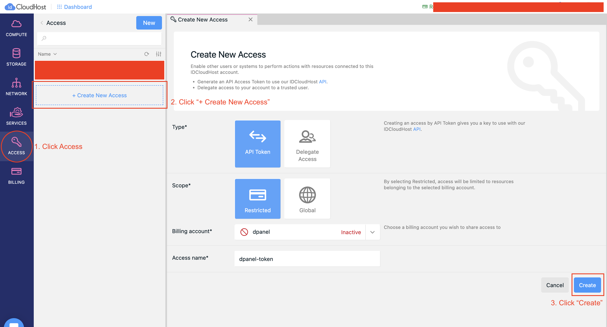
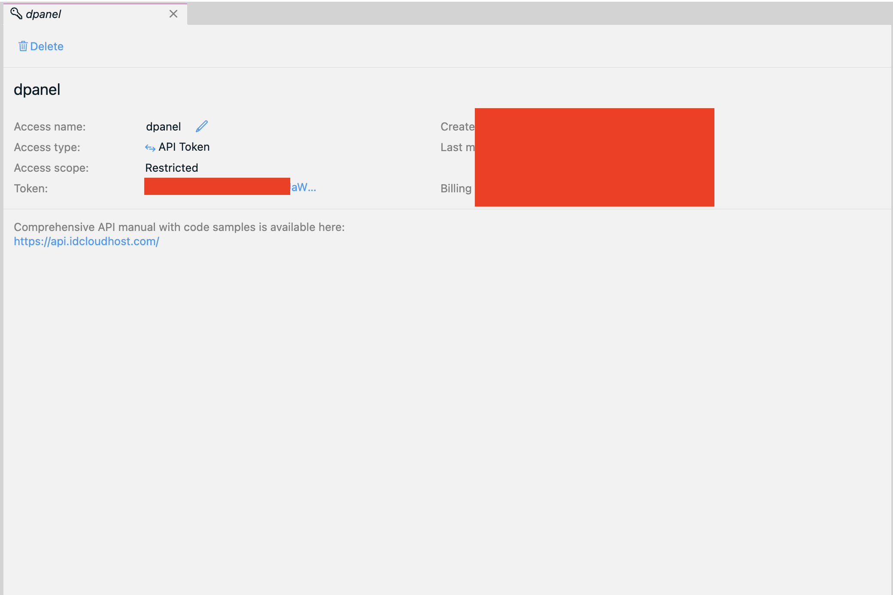
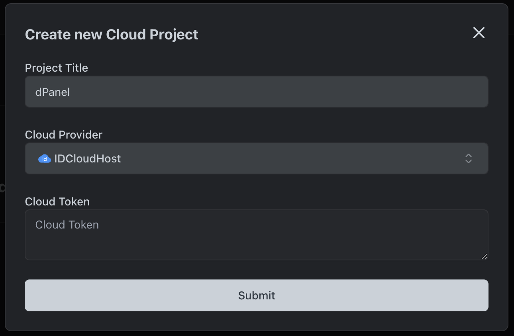
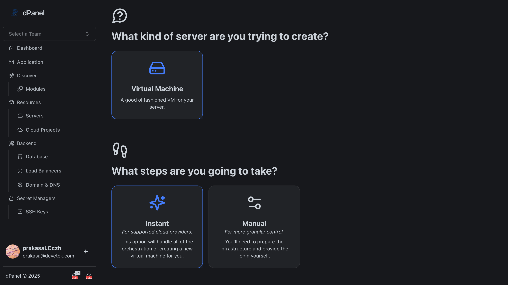
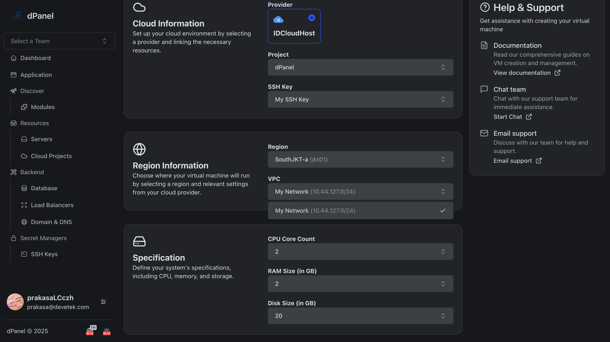

# IDCloudHost

Membuat server IDCloudHost dari dPanel, mempermudah pengelolaan server secara terpadu tanpa perlu berpindah-pindah dashboard.

Ikuti langkah berikut:

### Login IDCloudHost Console 

Kunjungi halaman login [console IDCloudHost](https://console.idcloudhost.com/hub/login) dan login dengan akun IDCloudHost.

### Buat Token

Buat token di IDCloudHost console yang akan digunakan di dPanel.

Salin *Token* di halaman detail token

### Buat *Cloud Provider* IDCloudHost

Buat Cloud Project baru di dPanel, dan pilih provider `IDCloudHost`.

### Buat server instant

Masuk ke halaman buat server [di sini](https://cloud.terpusat.com/v2/resources/servers/create), dan buat server instant.

Gunakan provider `IDCloudHost` dan pilih token yang sudah dibuat. Lalu masukkan informasi server, seperti regional, CPU, RAM, dan disk, dan lain-lain.

