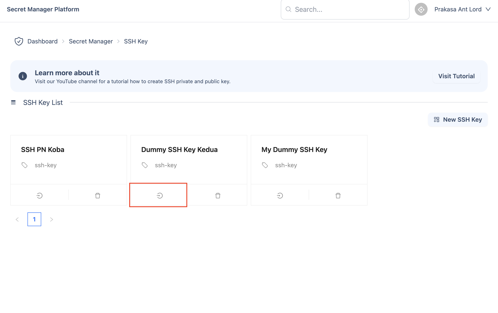
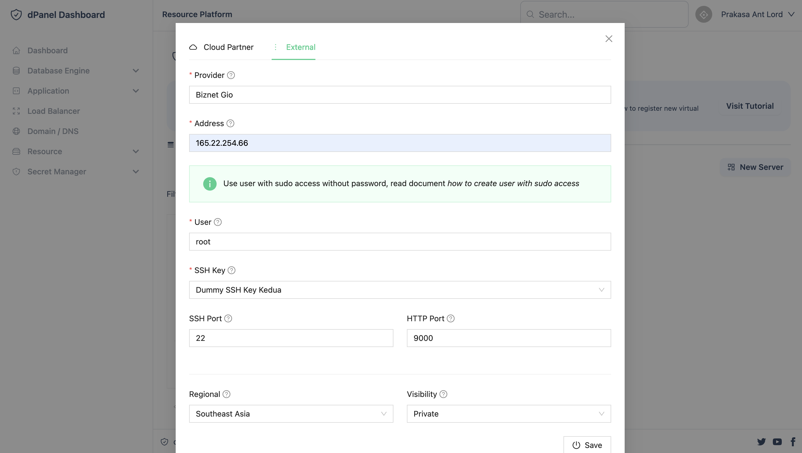
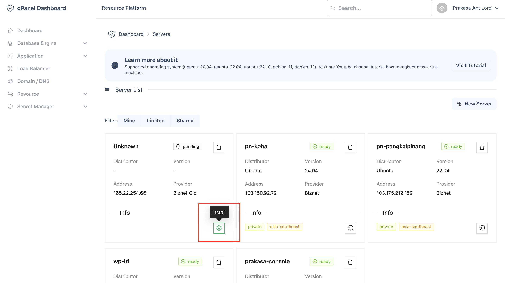

# Manual

Mendaftarkan mesin dari berbagai cloud provider menggunakan SSH private key yang dibuat dari dPanel. Akan mengurangi waktu instalasi server secara manual

1. Buat SSH Key di dPanel


2. Open SSH Key



3. Copy SSH Public Key


4. Login via SSH to the Server.

```sh
ssh <yourUser>@<yourIpAddress>
```

5. Paste SSH public key ke dalam mesin di file `~/.ssh/authorized_keys`

6. Buat Virtual Machine External di dPanel




6. Setup Virtual Machine External di dPanel

