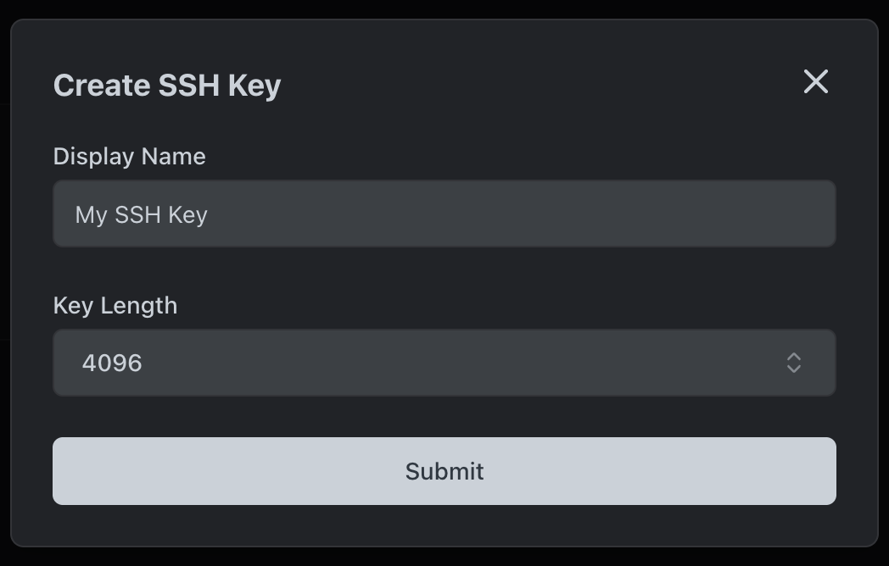

# Manual

Di halaman ini, kami menjelaskan langkah demi langkah cara menginstal dPanel di server dengan manual.

Untuk instalasi, Anda memerlukan server kosong dengan Ubuntu 24.04 atau 22.04 atau Debian 12 atau 11 dengan akses root.

Anda dapat membuat SSH key di dPanel, dari halaman [ini](https://cloud.terpusat.com/v2/secret-managers/ssh-key).

### Buat SSH Key



### Copy SSH Public Key


### Login via SSH ke server.

```sh
ssh <yourUser>@<yourIpAddress>
```

Tempel SSH public key ke dalam mesin di file `~/.ssh/authorized_keys`

### Daftarkan server 

Buat server baru di dPanel melalui link [di sini](https://cloud-beta.terpusat.com/v2/resources/servers/create).


### Isi Data Server

Masukkan informasi server yang telah dibuat, pilih provider, pilih SSH key yang telah dibuat, masukkan informasi alamat server, SSH port, dan port `dPanel Agent`. 

Jika ingin menjalankan `dPanel Agent` didalam lingkungan TSL/SSL, isi `dPanel Agent Address (Optional)` dengan domain, contoh: `dpanel-ip-123-45-241-167.domainkamu.com`. Kamu dapat membuat Load Balancer [di sini](https://cloud.terpusat.com/router) setelah proses instalasi server selesai.


