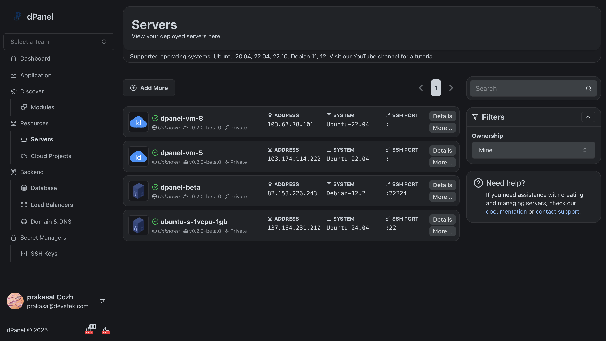
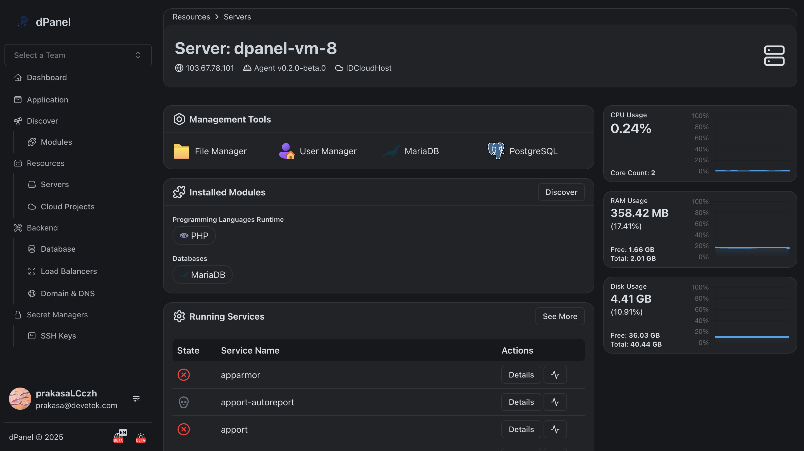

# Pengantar

## Apa itu dPanel?

dPanel adalah kontrol server modern yang dirancang untuk memfasilitasi pengelolaan banyak server dari berbagai penyedia layanan VPS / Cloud. Berfokus pada kemudahan penggunaan untuk kolaborasi dengan pengguna di dalam komunitas, instansi atau perusahaan.

Kemudahan menjalankan berbagai jenis aplikasi (PHP, Python, Golang, Ruby, Bun) yang telah terintegrasi dengan git repository.

Dukungan peluncuran instant:

- IDCloudHost
