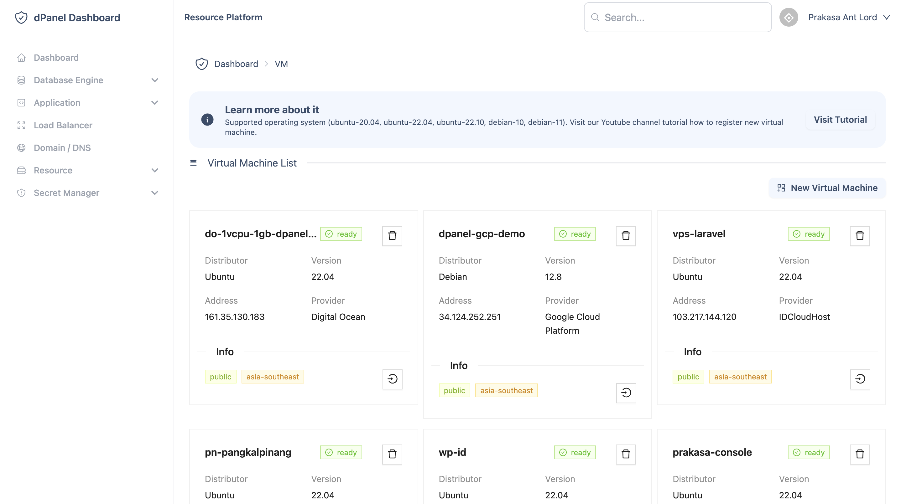

# Pengantar

## Apa itu dPanel?

dPanel adalah platform yang dirancang untuk memfasilitasi berbagi sumber daya dengan lebih mudah untuk komunitas, memungkinkan kolaborasi, koneksi, dan penggunaan aset bersama yang efisien.

Berfokus untuk menyelesaikan masalah keamanan cyber, untuk mempermudah impelemntasi prinsip-prinsip keamanan cyber yang dapat dikelola bersama.

Anda dapat berbagi sumber daya kepada pengguna lain yang terdaftar di dalam ekosistem dPanel dengan membuat visibilitas sumber daya menjadi **Public**:

Dengan demikian, jika layanan sudah tersedia di sumber daya tersebut, maka semua pengguna dapat menggunakan sumber daya tersebut untuk membuat layanan sesuai dengan kebutuhan mereka (*database, hosting, load balancer, dan lain-lain*).

Atau Anda dapat membatasi pengguna hanya untuk komunitas Anda ke dalam server, dengan cara menambahkan pengguna yang Anda kenal ke dalam sumber daya, ikuti langkah-langkah [cara menambah pengguna](/docs/id/platform/virtual-machine/user-management).

Semua keuntungan berbagi sumber daya tersebut salah satunya bertujuan untuk mempermudah menjalankan berbagai jenis aplikasi (**PHP, Python, Golang, Ruby, Bun**) yang telah terintegrasi dengan git repository yang terisolasi antar pengguna.

Dukungan peluncuran cepat untuk:

- IDCloudHost

