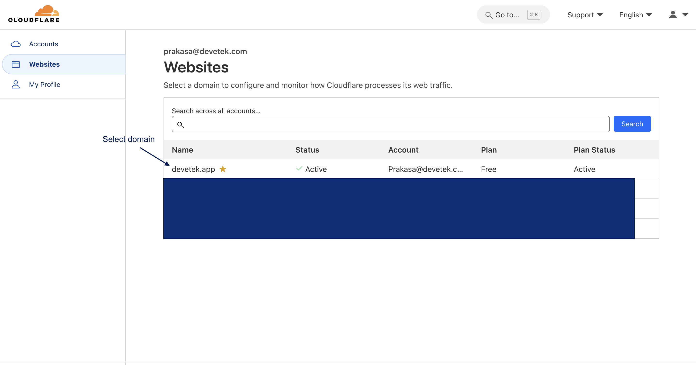
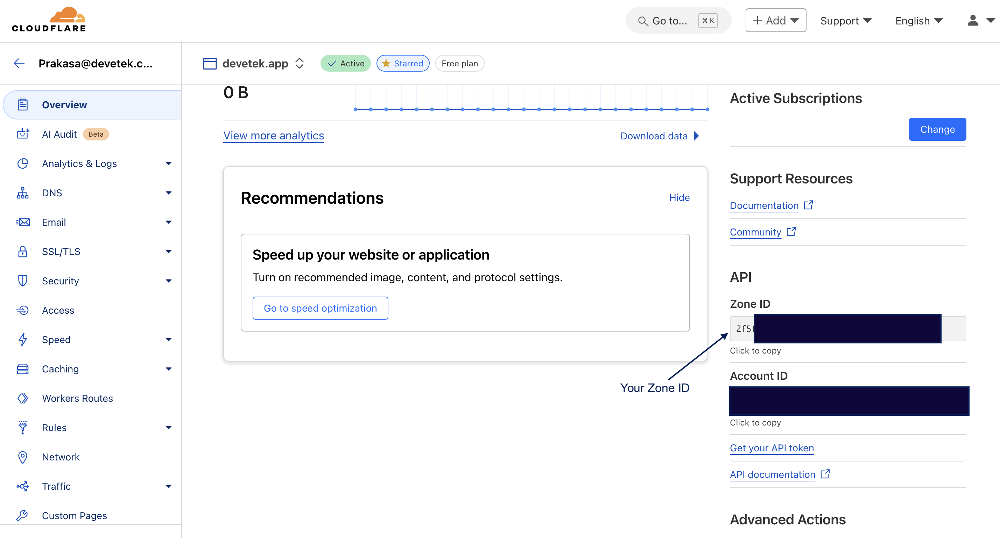
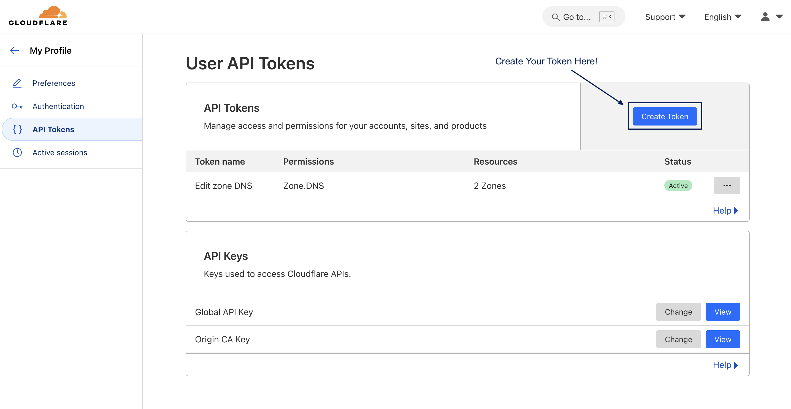
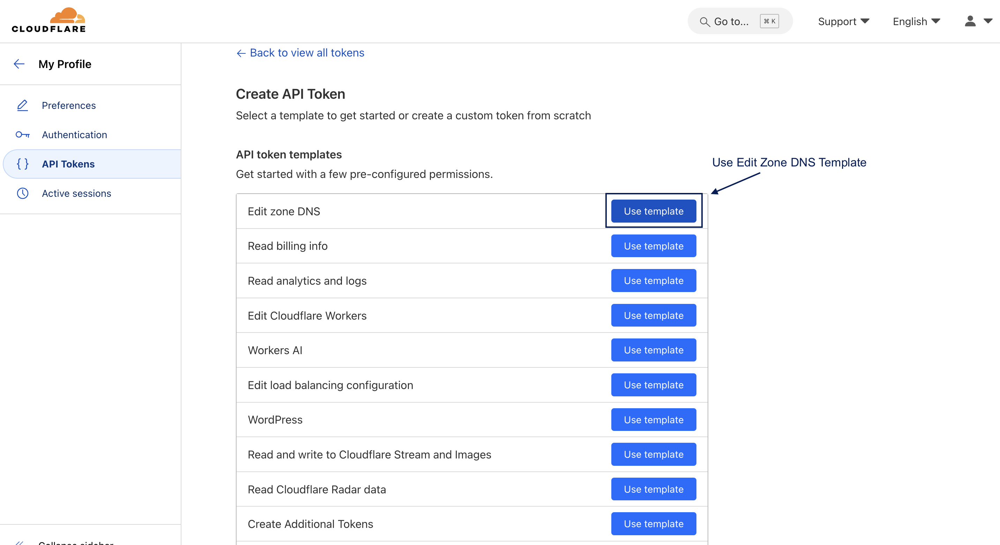
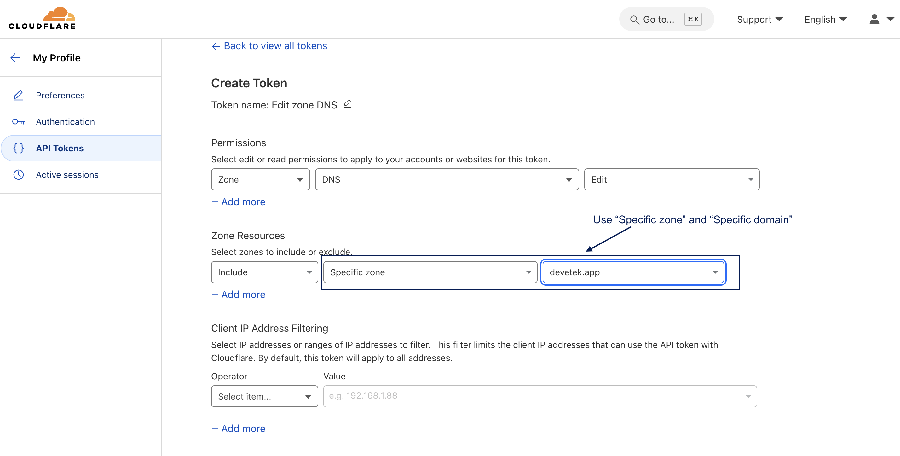
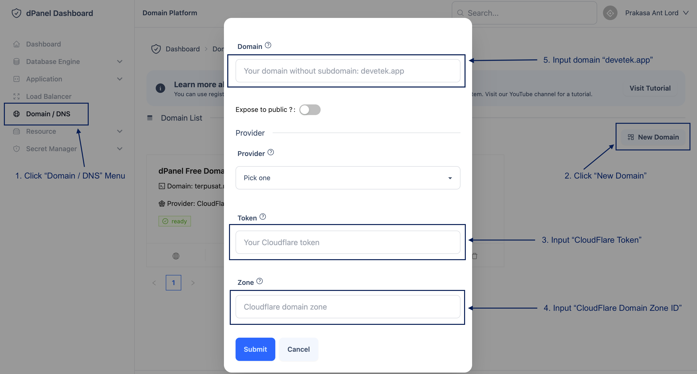
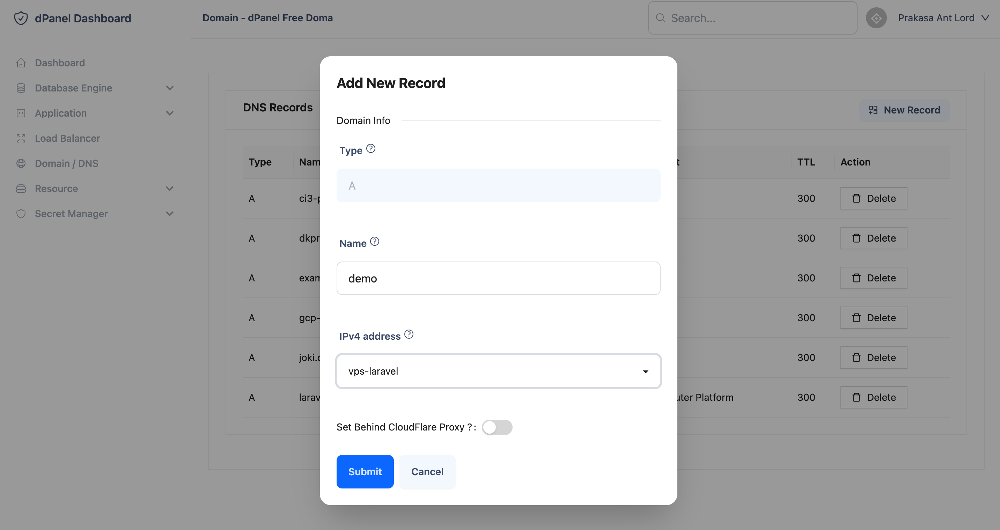
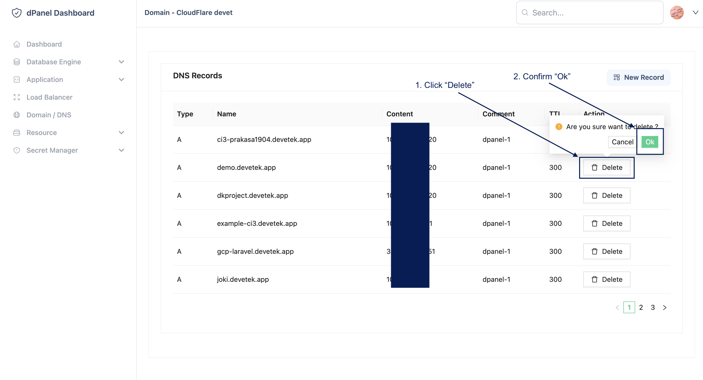

# Cloudflare

## Tambah Domain

1. Login ke CloudFlare Dashboard [di sini](https://dash.cloudflare.com/login)

2. Pilih domain di halaman "Website"

3. Salin domain Zone ID

4. Buat CloudFlare Token [di sini](https://dash.cloudflare.com/profile/api-tokens)

5. Gunakan Token Template "Edit Zone DNS"

6. Pilih detail pengaturan token

7. Tambah domain [di sini](https://cloud.terpusat.com/domain)

## Kelola Domain

Setelah sukses [tambah domain](/docs/id/platform/dns/add-domain), pengelolaan domain di dPanel akan mempermudah proses integrasi dengan ekosistem aplikasi. Beberapa hal yang dapat dilakukan di platform *Kelola Domain*: 

## Tambah Subdomain

Menambahkan subdomain dengan type A dapat langsung diarahkan ke *sumber daya terkelola* (virtual machine) yang sudah dibuat di dPanel.

<!-- ## Ubah Subdomain

Coming soon! -->

## Hapus Subdomain

Untuk mnghapus subdomain yang sudah tidak digunakan, berikut langkah-langkah:

