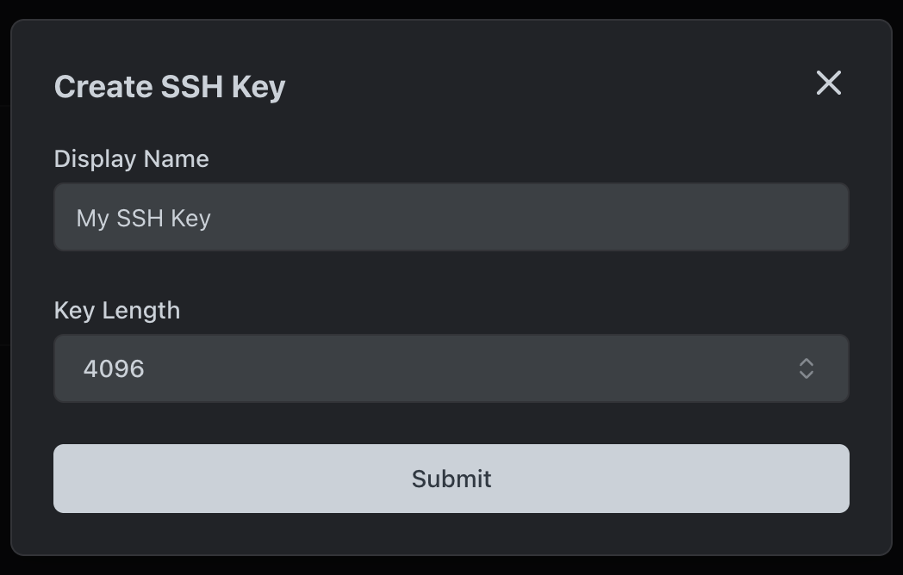
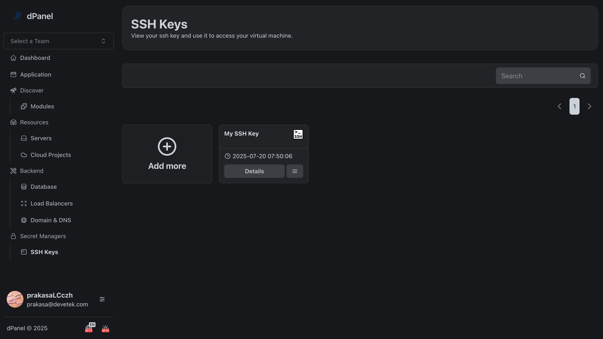

# SSH Key

Untuk membuat public dan private SSH key, pengguna tidak perlu lagi membuatnya secara manual. Proses pembuatan kunci SSH dapat dilakukan dari dPanel sehingga menjadi lebih cepat, otomatis, dan konsisten.

Buka halaman [SSH Key](https://cloud.terpusat.com/v2/secret-managers/ssh-key).

#### Buat SSH Key

#### List SSH Key
