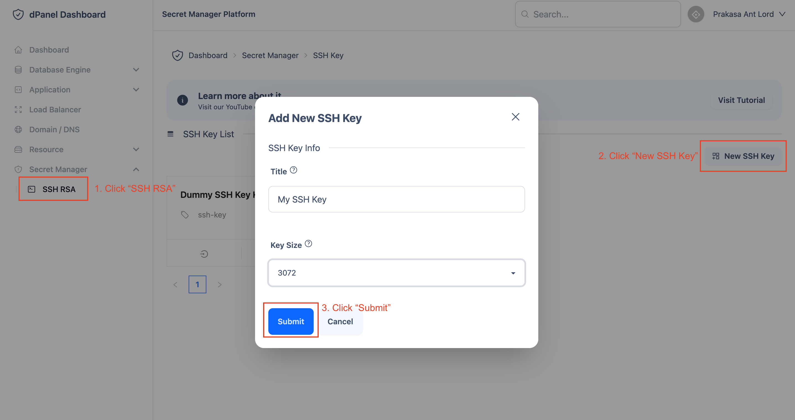
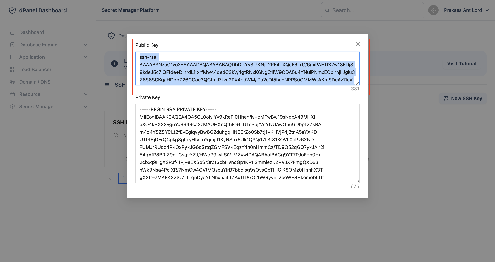

# SSH Key

Mempermudah proses pembuatan SSH public dan secret key. Sehingga tidak perlu membuat SSH secara manual.

Berikut adalah proses pembuatan SSH Key:

1. Pergi ke halaman Secret manager &raquo; [SSH Key](https://cloud.terpusat.com/secret/ssh-key)

2. Buat SSH Key


3. Copy SSH Public Key 


4. Login via SSH ke server.

```sh
ssh <yourUser>@<yourIpAddress>
```

5. Paste SSH public key ke dalam server di file ~/.ssh/authorized_keys, sehingga dapat digunakan login ssh dengan private SSH Key

```sh
ssh -i ssh-private-key <yourUser>@<yourIpAddress>
```