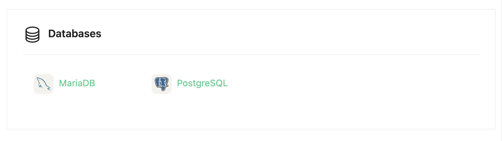
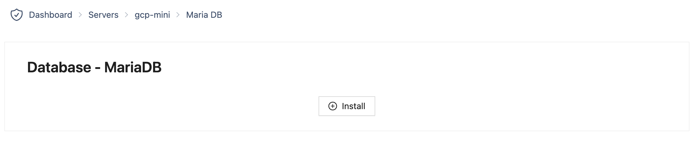
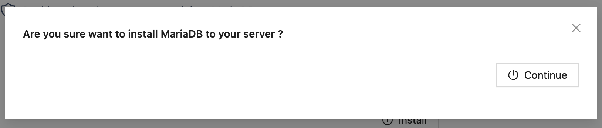
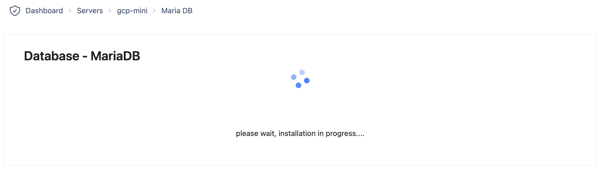
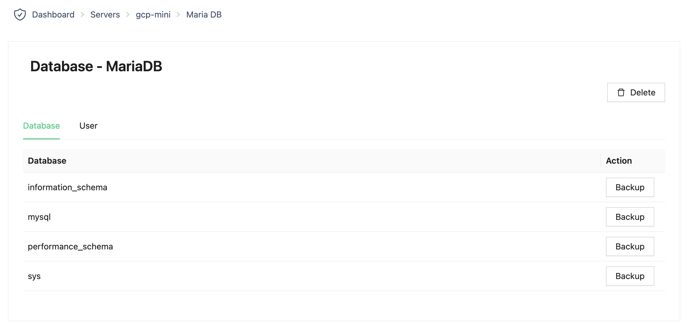

# MariaDB

1. Pilih database menu di halaman rincian server

2. Tekan tombol "Install" di halaman rincian basis data MariaDB

3. Tekan tombol "Continue" di pemberitahuan

4. Tunggu instalasi selesai

5. Instalasi selesai

