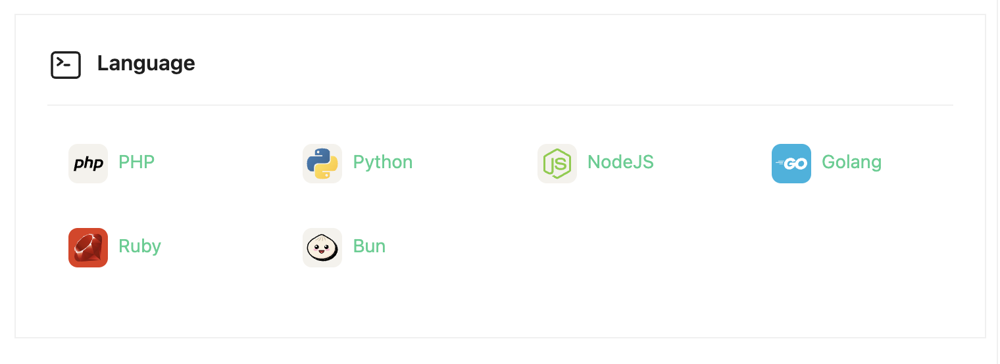

# Node.js

1. Pilih language menu di halaman rincian server



2. Tekan tombol "Add" di halaman rincian Node.js


3. Cari versi yang ingin dipasang

Untuk mencaari versi Node.js yang ingin dipasang, kunjungi halaman berikut ini:

```sh
https://nodejs.org/en/about/previous-releases
```

4. Masukkan versi, tekan tombol "Submit"


5. Tunggu instalasi selesai


5. Instalasi selesai

