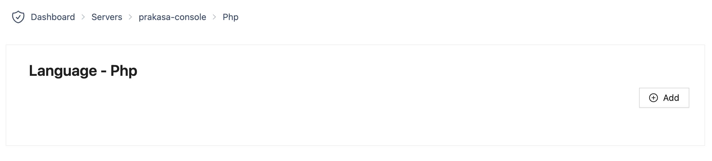
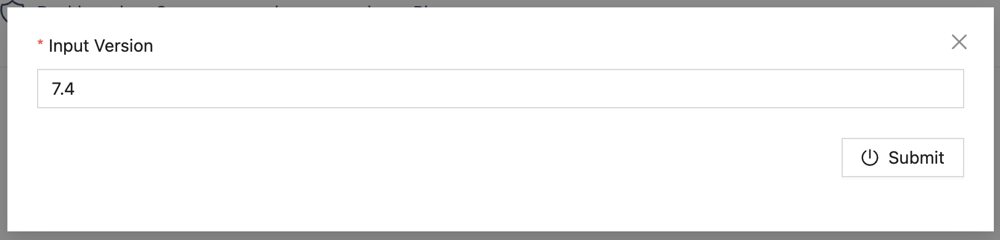
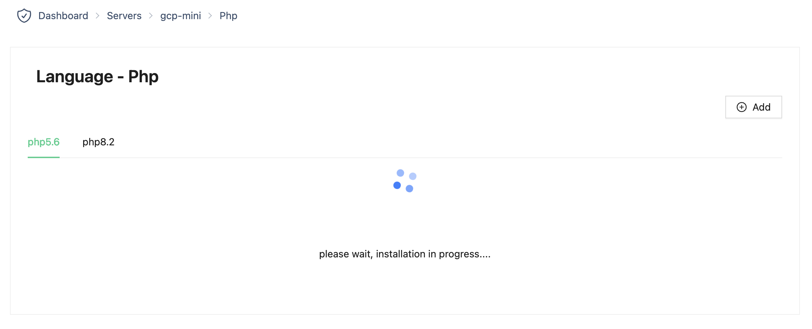
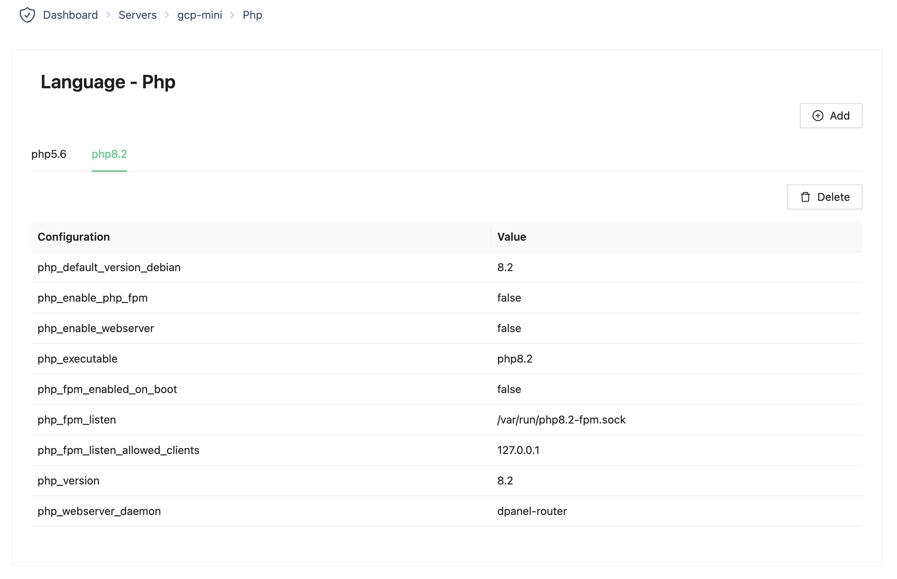

# PHP

1. Pilih language menu di halaman rincian server


2. Tekan tombol "Add" di halaman rincian PHP



3. Cari versi yang ingin dipasang

Untuk mencaari versi PHP yang ingin dipasang, kunjungi halaman berikut ini:

```sh
https://php.watch/versions
```

4. Masukkan versi, tekan tombol "Submit"



5. Tunggu instalasi selesai



5. Instalasi selesai

