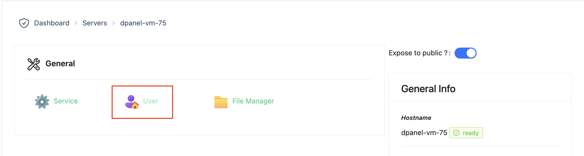
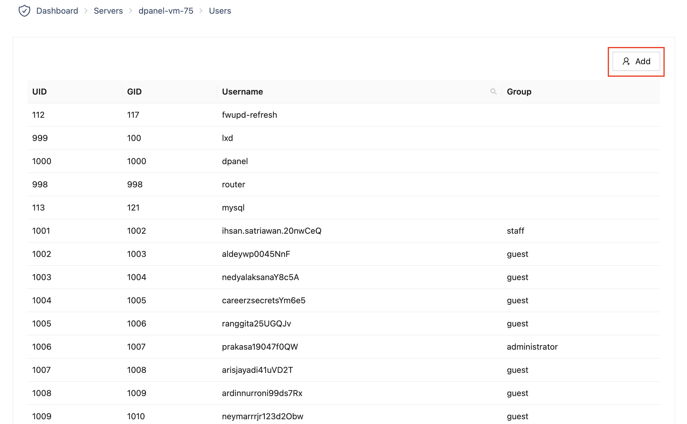
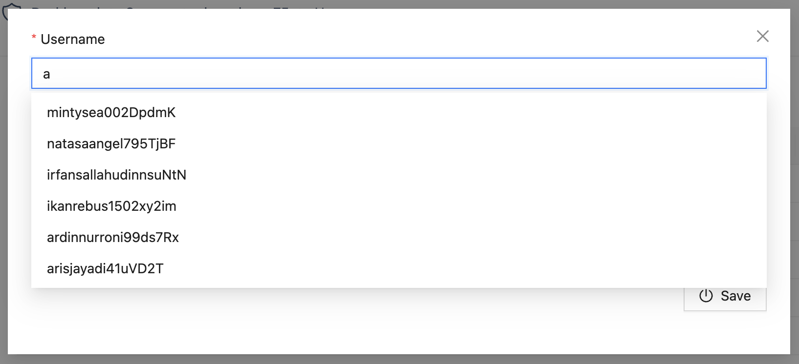
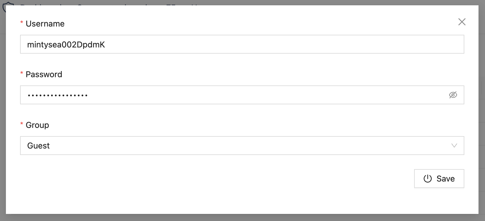

# Manajemen Pengguna

## Peran

Anda dapat membuat pengguna tambahan dengan akses terbatas. Setiap peran memiliki izin khusus, yang dijelaskan di bagian berikut.

### Administrator
Pengguna dengan peran Administrator memiliki izin penuh terhadap server, dapat melakukan pengaturan hingga penghapusan situs di seluruh server.

### Staff
Pengguna dengan peran staff memiliki izin penuh terhadap pengaturan hingga penghapusan situs yang berada dalam directory user tersebut.

### Guest

Pengguna dengan peran Guest hanya memiliki izin terbatas pada situs tertentu. Tidak memiliki akses ke dalam directory user tersebut.

User Guest dapat terdaftar di server Anda dengan 2 cara:
1. Didaftarkan oleh pemilik server
2. Membuat layanan (database, hosting, load balancer) dari server publik

## Pengguna

### Menambahkan Pengguna

1. Pilih user menu di halaman rincian server

2. Tekan tombol "Add" di halaman rincian user

3. Cari user yang akan ditambahkan

4. Lengkapi data "password" dan "group"

<!-- ### Mengubah User
### Menghapus User -->