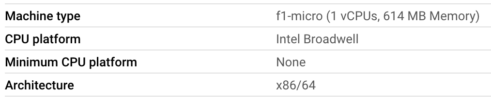
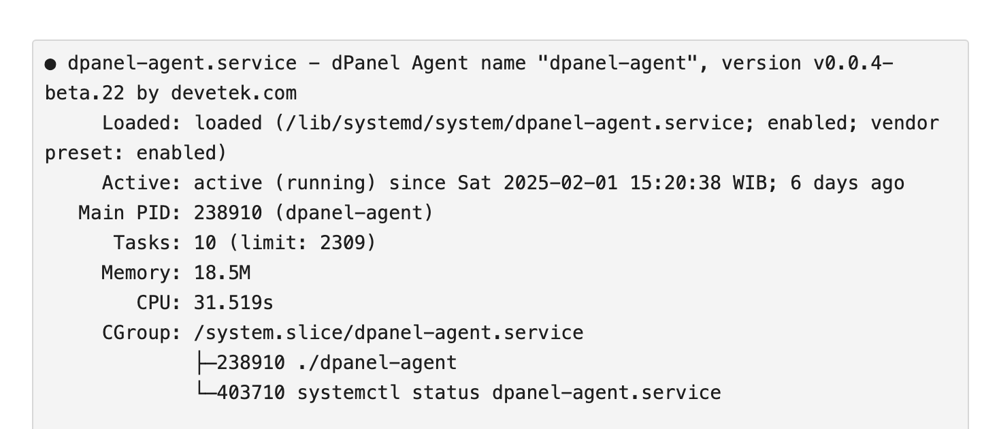

# Persyaratan

dPanel Agent tidak memerlukan sumber daya yang besar, sehingga dapat dijalankan pada server dengan spesifikasi yang sangat minim (1 core / 614 MB / 10 GB). Dibangun dengan bahasa pemrograman Golang, dan hanya bekerja jika diperlukan oleh dPanel Manager.

## Operating Systems

- [Ubuntu 24.04 (Noble Numbat)](https://releases.ubuntu.com/24.04/)
- [Ubuntu 22.04 (Jammy Jellyfish)](https://releases.ubuntu.com/22.04/)
- [Debian 12 (Bookworm)](https://wiki.debian.org/DebianBookworm)
- [Debian 11 (Bullseye)](https://wiki.debian.org/DebianBullseye)

Berikut adalah contoh dPanel digunakan di server GCP (Compute Engine) dengan tipe *f1-micro (1 vCPUs, 614 MB Memory)*.

### Utilizations
