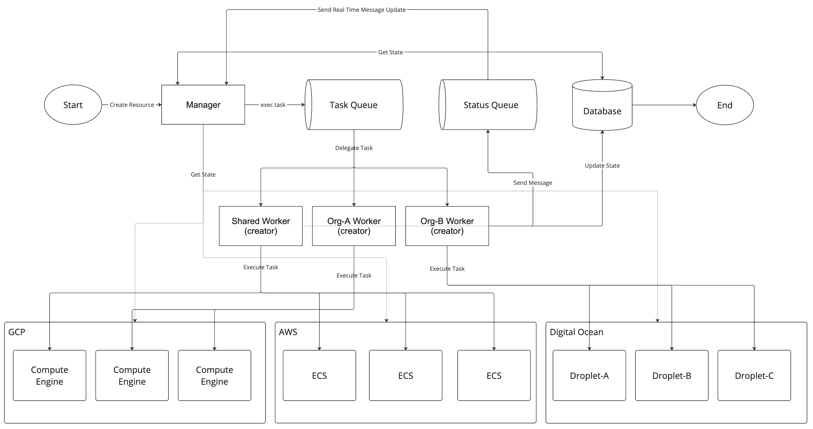
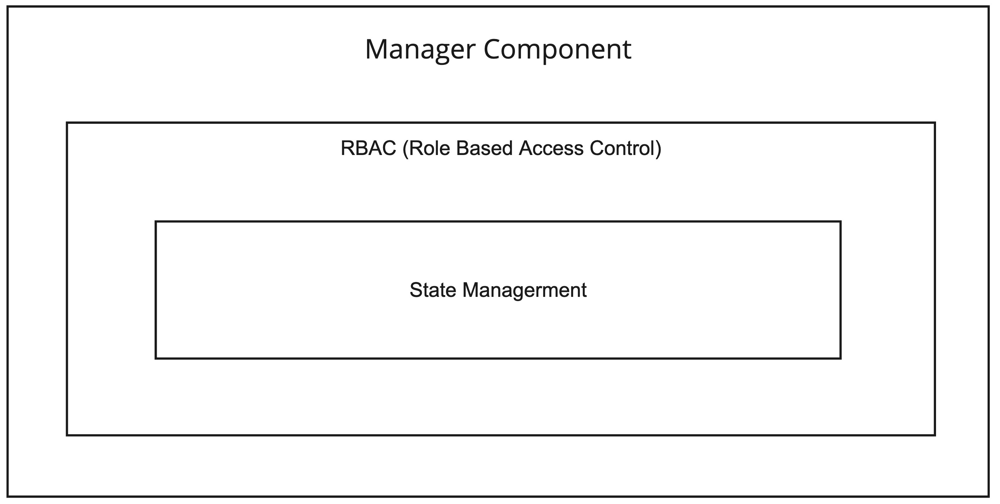
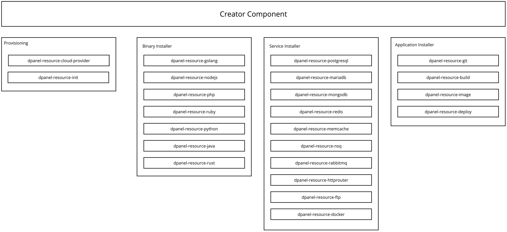

# Teknologi

## Arsitektur

dPanel dibangun menggunakan teknologi yang membuat ekosistemnya menjadi fleksibel dan dapat ditingkatkan sesuai dengan kebutuhan. Dibangun di atas teknologi yang sudah teruji dalam waktu lama dan skala besar:
- PostgreSQL
- Golang
- React.js
- Ansible

Juga digunakan oleh perusahaan teknologi besar seperti Google, Meta, Bytedance untuk melayani jutaan pengguna.

Berikut adalah arsitektur bagaimana dPanel bekerja untuk memastikan layanan dapat memenuhi kebutuhan peningkatan pengguna.

## Komponen

Bagian ini menjelaskan tentang 3 komponen dPanel yang bertanggung jawab dalam mengelola sumber daya dan aplikasi secara terorganisasi.

### Manager

Manager adalah layanan utama yang dapat Anda kunjungi dari "[cloud.terpusat.com](https://cloud.terpusat.com)". Yang bertanggung jawab dalam mengelola hak akses pengguna dan status. Dengan mengirimkan instruksi ke Creator, untuk melakukan tugas perubahan data. Dan berkomunikasi dengan Agent untuk mendaptakan status terakhir.

Manager juga memiliki peran penting dalam menyusun aturan-aturan dalam pengelolaan sumber daya, sehingga perubahan pada sumber daya yang melalui dPanel dipastikan dapat selalu dapat disinkronkan dan ditingkatkan, selama tidak ada perubahan manual yang dilakukan.

### Creator

Creator adalah layanan yang bertanggung jawab dalam memastikan dalam proses pembuatan hingga pengelolaan sumber daya dan aplikasi bersifat konsisten dan dapat ditingkatkan ke skala besar. Terbagi dalam beberapa sub komponen berdasarkan fungsi yang telah di standarisasi.

### Agent

Agent adalah layanan yang berjalan di cloud provider dan bertanggung jawab untuk menjalankan perintah dari manager dan mengirimkan informasi yang dibutuhkan oleh manager.

Ada 3 jenis agent yang digunakan untuk mengelola sumber daya sesuai dengan kebutuhan:
- Agent - Berjalan di dalam server dan berkomunikasi secara langsung dengan Manager
- Supervisor - Berjalan independen dan menjembatani komunikasi antara agen dan manager untuk mengelola server group

Untuk server tidak terkelola "non managed server" atau produk-produk turunan dari Cloud Provider seperti Cloud Function, Lamda, Cloud Run dan sebagainya, agent tidak diperlukan untuk berlajan secara berkelanjutan. Manager berkomunikasi secara langsung dengan Creator dan hanya mengelola status yang dikembalikan oleh Cloud Provider.